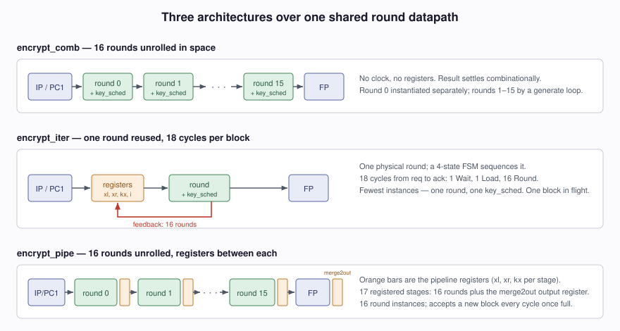
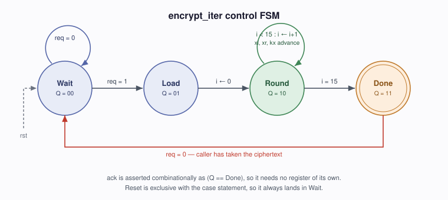
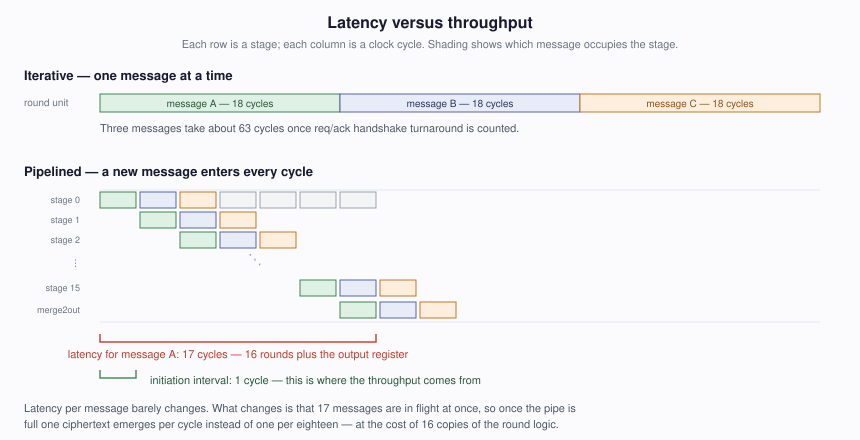
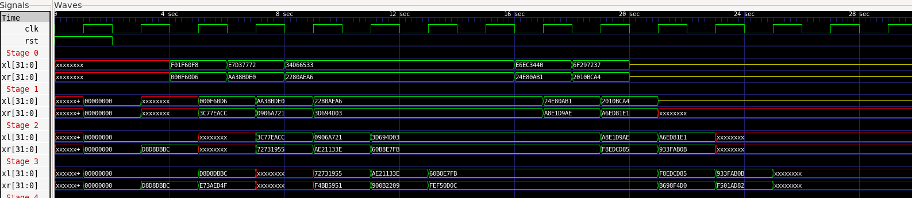
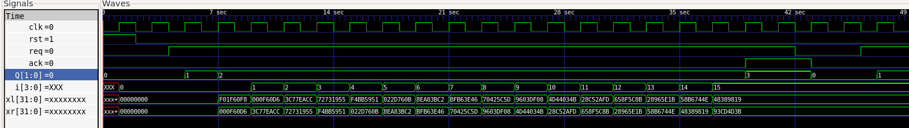
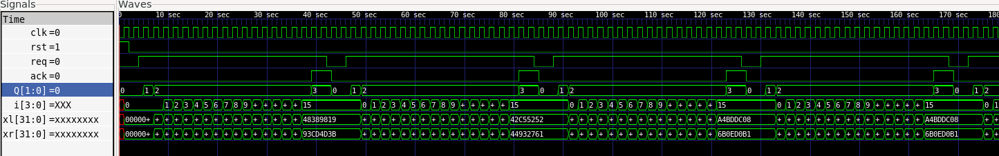

# DES in Verilog — Design Writeup

**This is an AI generated markdown file to explain my coursework. All actual 
coursework is my own - no use of AI. Coursework completed in December 2025.**

Three hardware implementations of the DES block cipher, built from one shared
round datapath: a **combinatorial** design, an **iterative** design, and a
**16-stage pipeline**. Written in Verilog, simulated and verified under Icarus
Verilog against the supplied test vectors.

This repository is the design writeup. The implementation itself is coursework
and stays private — see [Availability](#availability) below.

---

## The problem

DES encrypts a 64-bit block under a 64-bit key across 16 Feistel rounds. Each
round takes the two 32-bit halves of the block plus a 48-bit round key, and
produces the halves for the next round. A key schedule derives each round key
from the previous 56-bit key state by rotating its two 28-bit halves.

That structure has a fixed amount of work in it but says nothing about how the
work maps onto hardware. Sixteen rounds can be sixteen pieces of logic, or one
piece used sixteen times, or sixteen pieces with registers between them — same
arithmetic, three very different circuits. Building all three is the point of
the exercise.



## Shared building blocks

Both the round and the key schedule are shared verbatim by all three top-level
designs, so the differences between the designs are purely structural.

**`round`** implements one Feistel round. The right half is expanded to 48 bits
by permutation `E`, XORed with the round key, split into eight 6-bit groups
that each index a different S-box, recombined to 32 bits, permuted by `P`, and
XORed with the left half. The output halves are then swapped. There is no state
here at all — a round is a pure function of `(xl, xr, k)`, which is exactly what
makes it reusable across the three architectures.

**`key_schedule`** splits the 56-bit key state into two 28-bit halves, applies
a cyclic left rotation to each by an amount that depends on the round index,
recombines them, and derives the 48-bit round key with permutation `PC2`. It
emits both the round key and the next key state, so it can be chained in space
or fed back in time depending on the caller.

**`clr_28bit`** is the rotation itself. DES rotates by one bit in rounds 0, 1,
8 and 15 and by two bits elsewhere, so the shift amount is a function of the
round index rather than a constant.

## Design 1 — combinatorial

Sixteen `round` instances and sixteen `key_schedule` instances, chained by a
`generate` loop, with round 0 instantiated separately because it takes its
input from the initial permutation rather than from a predecessor.

No clock and no registers. The ciphertext is a pure combinational function of
the inputs and appears once the logic has settled. This makes it the simplest
design to reason about and the one with the longest critical path by a wide
margin — every one of the 16 rounds sits in a single unbroken path from `m` to
`c`, so the maximum clock frequency of any system containing it would be set
entirely by this block.

It is useful mainly as a correctness reference: if the round and key schedule
are right, this passes, and any failure in the other two designs is a
sequencing bug rather than a datapath bug.

## Design 2 — iterative

One `round` instance and one `key_schedule` instance, with registers holding
`xl`, `xr`, the key state `kx`, and a round counter `i`. A four-state FSM
sequences them.



The handshake is worth spelling out. `Wait` sits idle until `req` goes high.
`Load` captures the permuted message and key into the registers and zeroes the
counter. `Round` feeds the register outputs through the round logic and writes
the results back, incrementing `i`, until the counter reaches 15. `Done`
asserts `ack` and holds it until the caller drops `req`, at which point the
machine returns to `Wait`.

Two details in that description are easy to get wrong:

*The loop terminates at `i < 15`, not `i < 16`.* When `i` is 14 the registers
are being loaded with the inputs to the sixteenth round, and the round logic
is combinational, so the sixteenth result is available on the wires as soon as
those registers settle. Testing `i < 16` runs a seventeenth round. The counter
is also 4 bits, so it would wrap rather than exceed 15.

*`ack` is a wire, not a register.* It is assigned `Q == Done` combinationally.
Registering it would delay it by a cycle relative to the state it reports,
which the testbench's handshake would then observe out of step.

This is the smallest of the three designs — one round's worth of logic, plus
about 150 bits of register and a two-bit state — and the slowest per message.

## Design 3 — pipelined

The combinatorial design with registers inserted between every round.



Structurally this is the unrolled design again, but each stage's outputs land
in `xl[i]`, `xr[i]` and `kx[i]` rather than feeding the next round directly.
Stage *i+1* reads the registered outputs of stage *i*, so each clock edge
advances every message one round further along.

The consequence is the one that matters for a cipher: **latency is unchanged at
16 cycles, but the initiation interval drops from 16 cycles to 1.** Once the
pipe is full there are sixteen messages in flight simultaneously and one
ciphertext emerges per cycle. Throughput improves roughly sixteenfold for the
cost of roughly sixteen copies of the round logic — which is the trade you would
actually want for bulk encryption, and the wrong trade for a small embedded
device encrypting one block occasionally.

Because the pipeline registers break the critical path down to a single round,
this design also supports a far higher clock frequency than the combinatorial
one, so the real-world throughput gap is wider than the 16× the cycle counts
alone suggest.

### A bug worth documenting

The first working version of this module had a reset that did nothing:

```verilog
always @(posedge clk) begin
  if (rst == 1) begin
    xl[0] <= 0; /* ... */
  end
  xl[0] <= wirexl[0];   // not in an else — executes regardless
  /* ... */
end
```

Non-blocking assignment schedules the update rather than performing it, so when
two assignments to the same register execute in one pass the later one wins.
The reset branch ran and was then silently overwritten, every cycle. Synthesis
would have inferred registers with no reset at all.

It passed the testbench regardless, because reset is asserted before any
meaningful data is in flight and the pipeline flushes itself within 16 cycles.
Wrapping the advance logic in an `else` fixes it. The same pattern was present
in the iterative design, where the reset raced the `case` statement — there it
was more visibly wrong, since a reset arriving mid-encryption would leave the
FSM in `Round` rather than `Wait`.

I'm including this because "it passed the tests" and "it is correct" turned out
to be different claims, and the gap between them was invisible from the
simulation output alone.

A second instance of the same lesson: `reg [1:0] Q = 2'd0;` in the iterative
design simulates fine, but the initialiser is a second process driving `Q`
alongside the `always` block, and synthesis backends reject it — hardware has
no way to express a flip-flop's power-up value. The reset already forces `Q` to
zero, so the initialiser was redundant as well as unsynthesizable. Neither this
nor the reset bug is detectable from a passing testbench; both needed a
different tool to look at the same code.

## Results

Measured under Icarus Verilog against the 8 supplied test vectors. The
testbench clock has a period of 2 time units, so cycle counts below are derived
from the simulation end times.

| Design | Latency per block | Initiation interval | Critical path | Round instances |
| --- | --- | --- | --- | --- |
| `encrypt_comb` | combinational | — | 16 rounds | 16 |
| `encrypt_iter` | ~21 cycles | ~21 cycles | 1 round | 1 |
| `encrypt_pipe` | 17 cycles | 1 cycle | 1 round | 16 |

All three produce ciphertext matching all 8 vectors.

The iterative figure of ~21 cycles is 16 rounds plus the load state, the done
state, and the handshake turnaround — the FSM overhead is about 30% on top of
the useful work, which is the price of reusing one round unit.

The pipeline's 17 cycles is 16 round stages plus the output register on
`merge2out`. Its initiation interval of 1 is visible directly in the simulation
log: once the pipe fills, every subsequent cycle produces a result.

I did not measure gate counts — `iverilog -tsizer` and the SystemVerilog size
casts used in the generate loops turned out to be mutually exclusive, since the
sizer backend cannot start from a `$unit` compilation-unit scope. The
structural comparison is the meaningful one regardless: the combinatorial and
pipelined designs each instantiate 16 `round` and 16 `key_schedule` modules
against the iterative design's one of each, and the pipeline adds roughly 16
stages of `xl`, `xr` and `kx` registers (about 1900 flip-flops) on top of that.
Roughly 16x the logic for 16x the throughput, with latency unchanged.

## Verification

Each design has a self-checking testbench that reads known plaintext, key and
ciphertext triples from `vectors_m.txt`, `vectors_k.txt` and `vectors_c.txt`
and compares them against the module output. The unit-level modules (`round`,
`key_schedule`, `clr_28bit`) have testbenches taking values as plusargs, which
made it possible to check individual permutations against hand-worked examples
before assembling anything.

Two quirks of the vector set are worth knowing when reading the waveforms.

*Vectors 2 through 5 are identical* — the same key and plaintext repeated four
times. In the pipelined design this makes adjacent stages hold indistinguishable
values while that run is in flight, which looks like a broken pipeline until you
check the vector file. The screenshots below are taken from the early cycles,
where the messages in flight are distinct.

*The pipeline log shows `z` inputs and one `x` output near the end.* The
testbench stops feeding after 8 vectors but keeps clocking to flush the pipe,
so the last 17 slots are drain cycles. The 8 real results emerge at slots 17
through 24 and all pass.

### Waveforms



Four pipeline stages at the same instant, each holding a different message. A
value entering stage 0 appears in stage 1 on the next edge and stage 2 on the
one after — the diagonal is the data physically advancing one round per cycle.
This is the whole argument for the pipelined design in a single frame.



One full transaction of the iterative design. `Q` steps through Wait, Load and
Round, the counter `i` climbs 0 to 15 while `Q` holds at 2, then `Q` reaches
Done and `ack` is asserted. Note that the machine leaves the round state as `i`
hits 15 rather than 16 — the sixteenth result is already on the round's
combinational outputs when the counter reads 15, so testing `i < 16` would run
a seventeenth round.



The same design zoomed out across several transactions. The gaps between `ack`
pulses are what the pipelined version eliminates.

## Availability

The implementation is assessed university coursework, so the source is kept in
a private repository — both because publishing solutions undermines the
assignment for future students, and because the provided skeleton is licensed
CC BY-NC-ND, which does not permit distributing modified versions. Happy to
walk through the code directly or grant repository access on request.

## Credits

The assignment skeleton, testbenches, permutation and S-box definitions
(`util.v`), parameters (`params.h`) and build system are
Copyright © 2017 Daniel Page &lt;csdsp@bristol.ac.uk&gt;, distributed under the
Creative Commons BY-NC-ND 4.0 licence. The three top-level designs, the round,
the key schedule, the rotation module, and everything in this writeup are my
own work.
